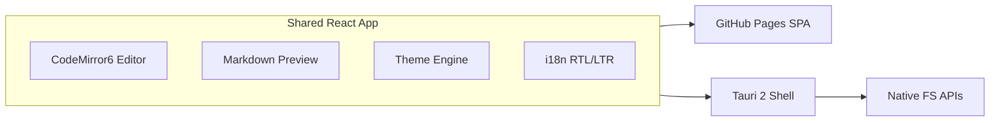

# MDyar — پلن پیاده‌سازی

## تصمیم‌های قفل‌شده

| موضوع | انتخاب |
|--------|--------|
| استک | Tauri 2 + React + TypeScript + Vite |
| لایسنس | GPL-3.0-or-later |
| پلتفرم‌های v1 | Windows, macOS, Linux (دسکتاپ) + وب (GitHub Pages) |
| زبان‌های UI اولیه | فارسی، انگلیسی، عربی |
| Markdown | GFM + KaTeX (ریاضی) + Mermaid |
| نام | **MDyar** |

## معماری

یک فرانت‌اند مشترک (Vite/React) برای وب و دسکتاپ؛ لایه Tauri فقط برای فایل‌سیستم، دیالوگ‌ها و بعداً file association.



**کتابخانه‌های اصلی**
- ادیتور: **CodeMirror 6** (BiDi بهتر و سبک‌تر از Monaco)
- رندر Markdown: **remark/rehype** + `remark-gfm` + `remark-math` / `rehype-katex` + Mermaid به‌صورت بلوک کد
- i18n: **i18next** + `react-i18next`؛ `dir` و `lang` روی `<html>` با تعویض زبان
- تم‌ها: JSON تم + CSS variables (رنگ، فونت ادیتور، فونت پریویو، اندازه، فاصله خط)
- اکسپورت HTML: ساخت سند کامل با CSS تم فعلی + KaTeX/Mermaid اینلاین/لینک‌شده

## ساختار ریپو (پیشنهادی)

```
mdyar/
  LICENSE                 # GPL-3.0
  README.md
  package.json
  vite.config.ts
  index.html
  src/
    app/                  # layout, split view, routing
    editor/               # CodeMirror setup + BiDi
    preview/              # MD → HTML + Math + Mermaid
    themes/               # theme types, defaults, manager UI
    i18n/                 # fa, en, ar + locale loader
    export/               # HTML export
    platform/             # web stubs vs Tauri invoke
  src-tauri/              # Tauri 2 (Rust)
  public/
  .github/workflows/      # build desktop + deploy Pages
```

کد مشترک؛ تشخیص محیط با `import.meta.env` / `@tauri-apps/api` تا وب بدون باینری Tauri کار کند.

## محدوده MVP (نسخه ۱)

1. **ادیتور + پریویو اسپلیت**
   - حالت پیش‌فرض: فقط پریویو (مناسب «باز کردن فایل»)
   - سوییچ به split: چپ/راست یا بالا/پایین با توجه به `dir` صفحه
   - همگام‌سازی اسکرول تقریبی ادیتور ↔ پریویو

2. **BiDi کامل**
   - `dir="auto"` روی بلوک‌های متنی در پریویو
   - پیکربندی CodeMirror برای RTL/LTR و متن مخلوط فارسی/عربی/انگلیسی
   - UI کامل RTL وقتی زبان fa یا ar است

3. **تم‌ها (با فونت)**
   - چند تم پیش‌فرض (روشن/تیره خنثی — بدون پالت بنفش کلیشه‌ای)
   - UI مدیریت تم: نام، رنگ‌ها، فونت ادیتور، فونت پریویو، اندازه فونت، line-height
   - ذخیره محلی (`localStorage` وب / app data دسکتاپ)
   - اعمال هم‌زمان روی ادیتور و پریویو

4. **i18n**
   - فایل‌های ترجمه `fa.json` / `en.json` / `ar.json`
   - تعویض زبان بدون به‌هم‌ریختگی جهت (یک منبع حقیقت برای `dir`)
   - ساختار پوشه `locales/` آماده برای زبان‌های بعدی

5. **Math + Mermaid**
   - `$...$` / `$$...$$` با KaTeX
   - ```` ```mermaid ```` در پریویو

6. **اکسپورت HTML**
   - دانلود `.html` خودکفا یا با CDN برای KaTeX/Mermaid
   - احترام به تم فعال

7. **وب رایگان**
   - بیلد static → GitHub Pages (`base` مناسب برای project pages)
   - بدون بک‌اند؛ فایل‌ها فقط در حافظه مرورگر (File System Access API جایی که باشد، وگرنه upload)

8. **دسکتاپ Tauri**
   - باز/ذخیره فایل `.md`
   - همان UI وب

9. **لایسنس و OSS**
   - `LICENSE` = GPL-3.0
   - README: نصب، توسعه، لایسنس، لینک نسخه وب

## خارج از MVP — حتماً در نقشه راه (must-have بعدی)

این‌ها در README بخش **Roadmap** و در اسکلت کد با TODO/stub مشخص می‌شوند تا فراموش نشوند:

- **اکسپورت Word (`.docx`)**
- **افزودن بسته زبان از UI** (وارد کردن JSON ترجمه)
- **File association**: دوبارکلیک روی `.md` → باز شدن MDyar با پریویو
- تم‌منیجر پیشرفته‌تر (ایمپورت/اکسپورت تم، اشتراک‌گذاری)
- بهبودهای دسکتاپ: منوی سیستم، recent files، drag-and-drop چندفایلی

## ترتیب پیاده‌سازی

1. اسکلت Vite + React + TS + GPL + README
2. ادیتور CodeMirror + پریویو remark (GFM) + split layout
3. BiDi + i18n (fa/en/ar) + سوییچ `dir`
4. KaTeX + Mermaid در پریویو
5. موتور تم + UI ساخت/ویرایش تم (فونت‌ها)
6. اکسپورت HTML
7. لایه `platform/` + پروژه Tauri 2 (باز/ذخیره فایل)
8. GitHub Actions: Pages + ساخت باینری‌های دسکتاپ
9. بخش Roadmap در README برای موارد post-MVP

## نکات فنی مهم

- **وب روی Pages**: مسیر فایل واقعی مثل دسکتاپ نیست؛ UX «باز کردن فایل» از دیسک مرورگر، نه path یونیکس/ویندوز.
- **Mermaid + RTL**: رندر دیاگرام LTR داخل سند RTL؛ کانتینر دیاگرام جدا با `dir="ltr"`.
- **فونت‌ها**: تم می‌تواند stack فونت سیستمی/وب‌فونت مشخص کند؛ برای فارسی/عربی فونت‌های پیش‌فرض مناسب (مثلاً Vazirmatn) در تم‌های پیش‌فرض.
- **Copyleft**: وابستگی‌ها سازگار با GPL؛ از باینری‌های proprietary اجتناب.

## معیار موفقیت MVP

- روی Win/macOS/Linux با Tauri اجرا می‌شود و روی GitHub Pages بدون نصب قابل استفاده است
- فایل MD با متن فارسی/عربی/انگلیسی مخلوط درست نمایش و ویرایش می‌شود
- split ادیتور|پریویو، تم با فونت سفارشی، تعویض fa/en/ar با RTL/LTR صحیح، Math و Mermaid، اکسپورت HTML کار می‌کند
- لایسنس GPL-3.0 و Roadmap post-MVP در ریپو موجود است
